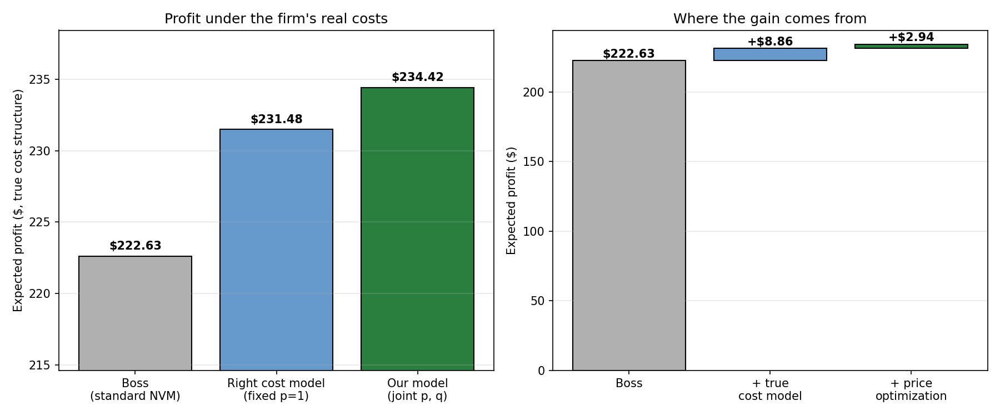

# Pricing and Production under Uncertainty: A Newsvendor Optimization

How many newspapers should a publisher print when demand is uncertain, and what
price should it charge? This project answers both questions jointly with a sequence
of optimization models, then asks the practical follow-up a manager actually cares
about: **is the standard newsvendor model the boss already uses good enough, or does
switching models raise profit?**

Course project for *Optimization (RM-294)*, M.S. Business Analytics.

---

## The problem

A publishing company prints a product whose demand is random and **price-sensitive**.
Each unit costs `$0.50` to produce up front. If demand exceeds what was printed, the
shortfall can be filled with a rush order at `$0.75` per unit; if too much is printed,
leftovers cost `$0.15` per unit to dispose of. Because rush orders cover any shortfall,
all demand is ultimately met, so revenue is always `price × demand`.

We have 99 daily observations of price and demand. The goal is to choose the price and
the print quantity that maximize expected profit, and to understand how reliable that
recommendation is.

## Approach

| Step | What we do | Model type |
|------|------------|-----------|
| 1 | Fit a linear regression of demand on price | OLS |
| 2 | Turn the regression residuals into demand scenarios at `p = 1` | — |
| 3 | Choose the best print quantity at `p = 1` | Linear program |
| 4 | Make price a decision variable and choose price **and** quantity jointly | Quadratic program |
| 6–7 | Bootstrap the data 500× to see how stable the optimum is | resampling |
| 8 | Build the boss's standard newsvendor model and compare it to ours | LP + evaluation |

The positive-part terms `(D − q)⁺` and `(q − D)⁺` are linearized with shortage and
excess variables. In Part 4, revenue `p·D(p)` carries a `β₁·p²` term; since `β₁ < 0`
that term is concave, so the joint problem is a **convex quadratic program** that Gurobi
solves directly (no nonconvex flag needed).

## Key results

**Demand is strongly price-sensitive.** The fitted line is
`Demand ≈ 1924.72 − 1367.71 · Price`: every extra dollar of price costs ~1,368 units of
demand.

| Quantity | Value |
|---|---|
| Optimal price `p*` (Part 4) | **$0.954** |
| Optimal print quantity `q*` (Part 4) | **535 units** |
| Expected profit at the joint optimum | **$234.42** |
| Fixed-price benchmark (Part 3, `p = 1`) | $231.48 (`q* = 472`) |

**The optimum is stable.** Across 500 bootstrap resamples, the optimal price barely
moves (mean **0.955**, std **0.014**) while the quantity is more sensitive to demand
noise (mean **535**, std **35**). Expected profit averages **$234.86** (std $9.00).

### Is the boss's model good enough? (Part 8)

The boss uses the **standard** newsvendor model — fixed price `p = 1`, lost sales, no
disposal cost — and chooses only the quantity. To compare fairly, we evaluate every
decision on the **same real-world cost structure** the firm actually faces (rush orders
plus disposal):

| Decision | Expected profit (true costs) |
|---|---|
| Boss — standard NVM, `p = 1`, `q = 570` | **$222.63** |
| Right cost model, still `p = 1`, `q = 472` | $231.48 |
| Our joint price–quantity model, `p = 0.954`, `q = 535` | **$234.42** |

Switching to our model raises expected profit by **$11.80 per cycle (+5.3%)**. That gain
splits into two parts: about **$8.86** comes from modeling the firm's true cost structure
(rush + disposal) instead of the textbook lost-sales model, and about **$2.94** comes
from optimizing price rather than holding it at $1.



**Honest caveat.** The new model's edge depends on those rush and disposal costs being
real. Under the boss's *own* lost-sales accounting, his quantity (570) is actually
appropriate and scores slightly higher than ours. The recommendation to switch is sound
because the firm genuinely faces rush and disposal costs — not because the boss's math
was wrong for the world he assumed.

## Repository structure

```
.
├── data/
│   └── price_demand_data.csv          # 99 price/demand observations
├── code/
│   ├── optimization_project3.ipynb    # full analysis, Parts 1–8, with figures
│   └── optimization_project3.py       # same analysis as a runnable script
├── output/
│   ├── part1_regression.png           # fit + residuals
│   ├── part2_demand_p1.png            # demand scenarios at p=1
│   ├── part3_profit_vs_quantity.png   # expected profit vs q
│   ├── part7_hist_price_quantity.png  # bootstrap marginals
│   ├── part7_scatter_marginals.png    # joint p*/q* scatter
│   ├── part7_hist_profit.png          # bootstrap profit distribution
│   ├── part8_model_comparison.png     # boss vs our model
│   └── results_summary.csv            # all headline numbers
├── report/
│   ├── Optimization_Fall_Project_3_Report.pdf   # final written report
│   └── project_3_description.pdf                 # assignment prompt
└── README.md
```

## Reproduce

Requires Python 3 and a Gurobi install (the free size-limited license is enough — the
models are small).

```bash
pip install pandas numpy scikit-learn matplotlib gurobipy nbconvert ipykernel

# Option A: run the script (regenerates every figure + results_summary.csv)
cd code
python3 optimization_project3.py

# Option B: run the notebook end to end
cd code
python3 -m nbconvert --to notebook --execute --inplace optimization_project3.ipynb
```

Random seeds are fixed (`np.random.seed(42)` for the single bootstrap, `123` for the
500-replication run), so the numbers above reproduce exactly.

## Notes and limitations

- **Linear demand.** A straight-line demand curve is a strong assumption; it fits this
  data well over the observed price range but should not be extrapolated. Price is
  bounded to the observed range `[0.76, 1.25]` for exactly this reason.
- **Residual-based scenarios.** Uncertainty comes from reusing the 99 regression
  residuals, which assumes the same noise distribution holds at every price.
- **Bootstrap captures sampling error**, not model misspecification — if the linear form
  is wrong, the tight bootstrap intervals understate the true uncertainty.

## Team

Andrew Chen, Bakr Kathuda, Gabriel Sanders, Nathan Arimilli, Tanya Jain.
